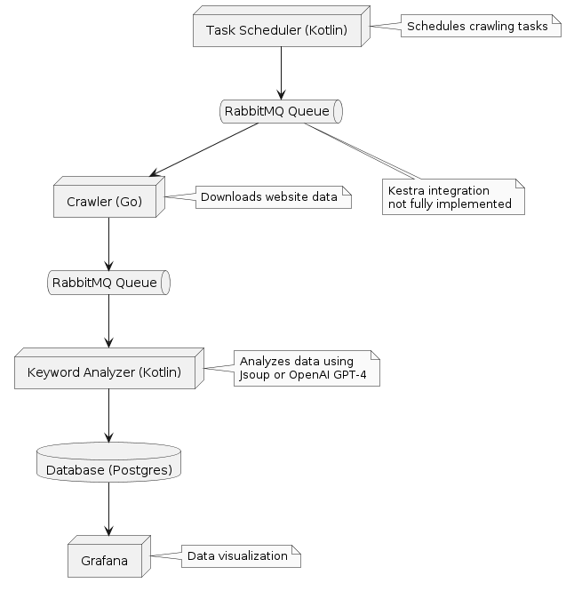

# Website Crawler and Keyword Analyzer

This project implements a website crawler and keyword analyzer using a combination of Go and Kotlin. The crawler is
built using the Colly library in Go, while the keyword analysis is performed using either Jsoup or the OpenAI GPT-4o
language model in a Kotlin application. The results are persisted in a database, and the crawling tasks are scheduled
within the Kotlin app.

## Architecture

The project consists of the following main components:

1. Crawler (Go): The crawler is implemented using the Colly library in Go. It connects to a RabbitMQ queue and waits for
   crawling tasks to execute. Once a task is received, the crawler downloads the website data and sends it to the Kotlin
   app for further processing.

2. Keyword Analyzer (Kotlin): This Kotlin application receives the downloaded website data from the crawler through a
   RabbitMQ queue. It analyzes the data using either Jsoup or the OpenAI GPT-4 language model to extract relevant
   keywords and their incidence counts. The results are then persisted in a database.

3. Task Scheduler (Kotlin): The crawling tasks are scheduled within the Kotlin application. Initially, the goal was to
   use Kestra for task scheduling and send the tasks through a RabbitMQ queue to the crawler. However, due to time
   constraints, the scheduling was implemented directly in the Kotlin app.

4. Database (Postgres): The analyzed keyword data is stored in a database for further analysis and visualization.

5. Grafana's integration was done, but setting up the dashboard out of the box with docker-compose up was not completed
   due to time constraints.



## Getting Started

To run the project, follow these steps:

1. Clone the repository:
    ```bash
    git clone https://github.com/ktenman/website-crawler.git
    ```
2. Navigate to the project directory
    ```bash
    cd website-crawler
    ```
3. Build and run the project using Docker Compose:
   ```bash
    docker-compose up 
    ```

4. Access the Swagger documentation for the REST endpoints:
   Keyword Analyzer: [http://localhost:8081/swagger-ui/](http://localhost:8081/swagger-ui/)

## Time Constraints

The goal was to complete the project within 8 hours. The most complicated parts, such as crawling, keyword analysis, and
data persistence, were successfully implemented. Grafana integration was done, but setting up the dashboard out of the
box with docker-compose up was not completed due to the time limitation. Additionally, the integration of Kestra for
task scheduling was not fully implemented due to time constraints.

## Technologies Used

The project utilizes the following technologies and languages:

* Go: Used for implementing the crawler with the Colly library.
* Kotlin: Used for keyword analysis, task scheduling, and data persistence.
* RabbitMQ: Used as a message queue for communication between the crawler and the Kotlin app.
* Jsoup: Used as an alternative to OpenAI GPT-4o for keyword analysis.
* OpenAI GPT-4o: Used as an advanced language model for keyword analysis.
* Docker: Used for containerization and easy deployment of the project.
* Docker Compose: Used for defining and running multi-container Docker applications.
* Grafana: Used for data visualization (partially implemented).

## Future Improvements

The following improvements could be made to the project:

1. Complete the integration of Kestra for task scheduling and sending tasks through RabbitMQ to the crawler.
2. Implement the connection of the time-based REST endpoint from the Kotlin app with Grafana for enhanced data
   visualization.
3. Optimize the keyword analysis algorithms for better performance and accuracy.
4. Enhance the error handling and logging mechanisms for better debugging and monitoring.
5. Implement additional features such as sentiment analysis and topic modeling.

---
This README aims to guide developers through setting up, running, and understanding the core functionalities and
technical aspects of the Website Crawler 
